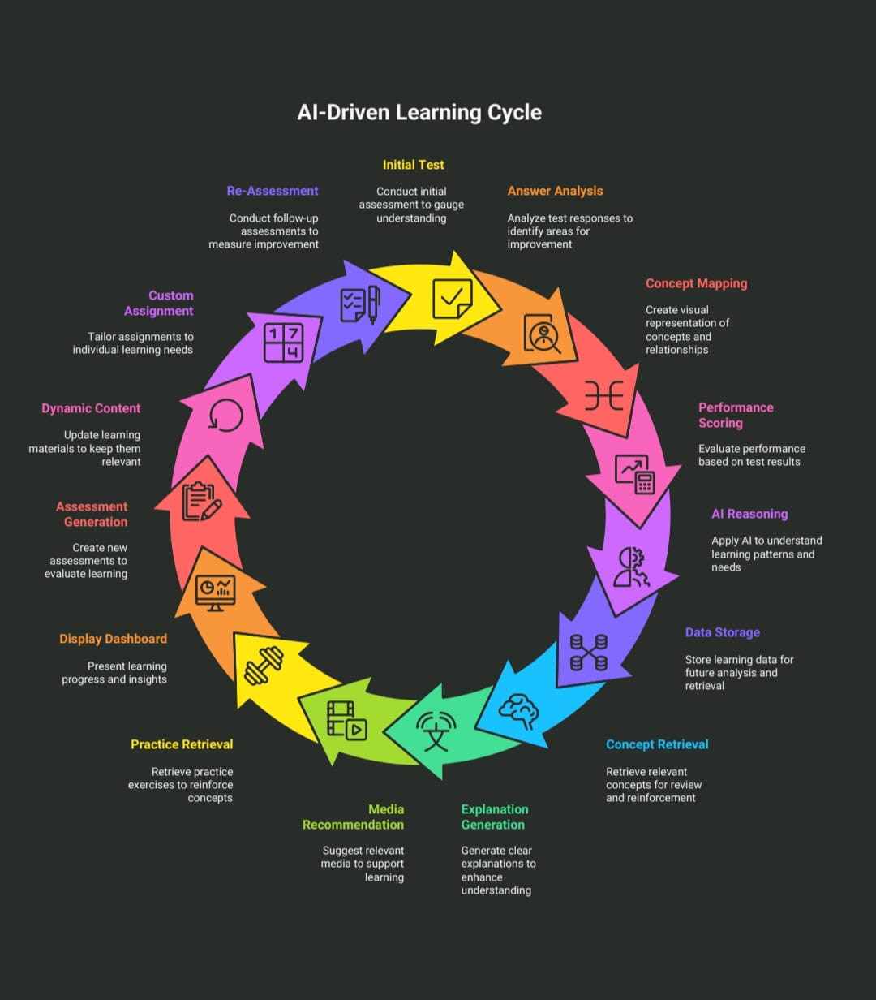

# NeuroLearn: AI-Powered Personalized Learning Platform

A web application that uses AI to provide a personalized learning experience for students, helping them identify and improve on weak concepts.

## 🚀 Features

* **User Authentication:** Secure registration and login system.
* **Topic Selection:** Browse content by Class, Subject, and Topic.
* **AI-Generated Notes:** Dynamically generated, markdown-formatted notes for selected topics using the Google Gemini API.
* **Dynamic Video Recommendations:** Relevant YouTube tutorial video links suggested by Gemini (with YouTube API fallback).
* **AI-Generated Quizzes:** Initial assessment quizzes generated by Gemini based on the selected topic.
* **Intelligent Analysis:** Gemini analyzes incorrect test answers to pinpoint specific weak concepts.
* **Personalized Feedback:** AI provides clear explanations, examples, and targeted practice questions for misunderstood concepts.
* **Targeted Video Support:** Finds relevant YouTube videos specifically for the identified weak concepts.
* **Dynamic Assessment Loop:** Generates follow-up tests focusing only on weak areas, categorized by difficulty (Easy, Medium, Hard).
* **Progress Tracking:** All test results are saved to a database.
* **Interactive Analytics Dashboard:**
    * Pie chart showing tests attempted per subject.
    * Line chart visualizing weekly average score trends.
    * Detailed table history of all tests taken.
    * Clickable pie chart filters the line chart and table by subject.

## 🛠️ Tech Stack

* **Frontend:**
    * React.js (using Vite)
    * `react-plotly.js` & `plotly.js` (for charts)
    * CSS (for styling)
* **Backend:**
    * Python 3
    * Flask (web framework)
    * `flask-cors` (for handling cross-origin requests)
    * `python-dotenv` (for managing API keys)
    * `google-generativeai` (for Gemini API)
    * `google-api-python-client` (for YouTube Data API)
    * `pandas` (for data handling in analytics)
* **Database:**
    * SQLite 3
* **APIs:**
    * Google Gemini API (for notes, tests, analysis)
    * Google YouTube Data API v3 (for video search)

## ⚙️System Architecture



## 🛠️ Tech Stack

##  Setup Instructions

1.  **Clone the Repository:**
    ```bash
    git clone <your-repository-url>
    cd <your-repository-name>
    ```

2.  **Backend Setup:**
    * Navigate to the `backend` directory:
        ```bash
        cd backend
        ```
    * Create and activate a Python virtual environment:
        ```bash
        python -m venv venv
        # On Windows:
        .\venv\Scripts\activate
        # On macOS/Linux:
        source venv/bin/activate
        ```
    * Install required Python packages:
        ```bash
        pip install Flask flask-cors pandas google-generativeai google-api-python-client python-dotenv
        ```
    * Create a `.env` file in the `backend` directory:
        ```env
        GEMINI_API_KEY="YOUR_GEMINI_API_KEY"
        YOUTUBE_API_KEY="YOUR_YOUTUBE_API_KEY"
        ```
        *(**Important:** Replace placeholders with your actual keys. Ensure billing is enabled and APIs are activated in your Google Cloud Project for Gemini and YouTube Data API v3.)*

3.  **Frontend Setup:**
    * Open a **new terminal**.
    * Navigate to the `frontend` directory:
        ```bash
        cd ../frontend 
        # (or cd path/to/your/project/frontend if you closed the terminal)
        ```
    * Install Node.js dependencies:
        ```bash
        npm install
        ```

## ▶️ Running the Application

You need to run both the backend and frontend servers simultaneously.

1.  **Start the Backend Server:**
    * In your first terminal (inside the `backend` directory with the virtual environment activated):
        ```bash
        python app.py
        ```
    * The server will start, typically on `http://localhost:5000`.

2.  **Start the Frontend Server:**
    * In your second terminal (inside the `frontend` directory):
        ```bash
        npm run dev
        ```
    * This will compile the React app and open it in your browser, typically at `http://localhost:5173`.

3.  **Access the App:** Open the frontend URL (`http://localhost:5173` or similar) in your web browser.
